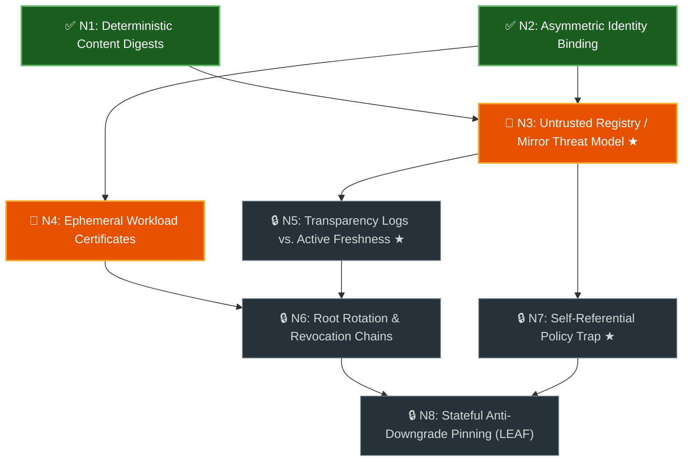

# Graph Learn (`/graph-learn`)

Use this skill to help the user build a genuine, load-bearing mental model of a
complex technical domain, specification, or codebase architecture. Skimming an
AI summary of an unfamiliar topic creates an illusion of competence; walking a
**Knowledge Space Theory (KST) prerequisite graph** one frontier at a time
ensures every foundational invariant clicks before dependent concepts are
unlocked.

## Core Primitives (Knowledge Space Theory)

Model the target domain as a minimal prerequisite Directed Acyclic Graph (DAG):

| Primitive                                | Symbol                    | Definition & Rule                                                                                                                                                                                            |
| :--------------------------------------- | :------------------------ | :----------------------------------------------------------------------------------------------------------------------------------------------------------------------------------------------------------- |
| **Domain**                               | $Q = \{N_1, \dots, N_k\}$ | **7 to 15 atomic knowledge nodes** scoped to the user's goal. Each node is a single load-bearing invariant or mechanism—not a broad chapter or trivial vocabulary term.                                      |
| **Hard Prerequisite Edge**               | $u \to v$                 | Node $v$ **cannot** be genuinely mastered or applied without first understanding $u$. Omit loose "related-to" associations.                                                                                  |
| **Hasse Diagram (Transitive Reduction)** | $\preceq$                 | Keep **minimal hard prerequisites only**. Never draw transitive shortcut edges ($u \to w$ when $u \to v \to w$ already exists).                                                                              |
| **Knowledge State**                      | $K \subseteq Q$           | The subset of nodes the user has empirically verified through diagnostic or transfer gates (`✅ Passed`).                                                                                                    |
| **Outer Fringe (Active Frontier)**       | $F^+(K)$                  | Unmastered nodes whose incoming hard prerequisites are **all** in $K$ ($v \notin K$ where $\forall u \prec v, u \in K$). These are the **only** nodes eligible for teaching and probing on the current turn. |
| **Threshold Concept**                    | `★` / `[THRESHOLD]`       | The 2–4 transformative mental shifts in the DAG that permanently restructure how the learner reasons about the system (e.g., shifting from perimeter/TLS trust to an untrusted-intermediary model).          |

---

## The Workflow at a Glance

Copy this checklist to track progress across the session:

- [ ] **Phase 1: Scope & Persist the Prerequisite DAG** → Output:
      `<topic>_learning_graph.md` with live color-coded Mermaid diagram
- [ ] **Phase 2: Diagnostic Calibration** → Output: Initial $K$ and active Outer
      Fringe $F^+(K)$ (Execution Halted for User Input)
- [ ] **Phase 3: Outer-Fringe Teaching & Verification Loop** → Output: Iterative
      Socratic gates, targeted pedagogy, fresh transfer checks, and live diagram
      updates
- [ ] **Phase 4: Dynamic Graph Mutation (As Needed)** → Output: Inserted or
      split prerequisite nodes when hidden gaps surface
- [ ] **Phase 5: Mastery Closure & Practical Payoff** → Output: Final KST
      mastery summary and transition to real codebase/design work

---

## Detailed Execution Phases

### Phase 1: Scope & Persist the Prerequisite DAG

1. **Ground in Primary Sources First:** Read the relevant codebase modules,
   design documents, specifications, or reference materials before designing the
   graph. Do not invent speculative domain rules when source code or specs are
   available.
2. **Construct the Persistent Graph Document:** Save `<topic>_learning_graph.md`
   in the session's artifact or scratch directory. Keep **Part 1 (Assessment
   Specification)** strictly separate from **Part 2 (Pedagogical Appendix)** so
   diagnostic questions never leak hints or spoilers.
3. **Render the Live Color-Coded Mermaid Hasse Diagram:** Initialize the diagram
   with explicit visual state classes from Turn 1 and update it after every
   gate:
   - `passed` (`✅`): Mastered / Verified ($u \in K$).
   - `fringe` (`🎯`): Ready / Active Outer Fringe ($u \in F^+(K)$). Include
     partial progress badges such as `(1/2)` when a multi-part node is half
     complete.
   - `locked` (`🔒`): Blocked / Pending (waiting on upstream prerequisites).
   - Flag threshold concepts with `★` or `[THRESHOLD]` inside the node label.

#### Persistent Graph Document Template (`<topic>_learning_graph.md`)

````markdown
# Prerequisite DAG: {Topic Title}

- **Legend:** 🟢 **Mastered ($K$):** `N1`, `N2` · 🟠 **Active Outer Fringe ($F^+(K)$):** `N3`, `N4` · ⚪ **Locked:** `N5`–`N8`



---

## Part 1: Assessment Specification (Nodes & Diagnostic Gates)

### `N3`: Untrusted Registry / Mirror Threat Model `[THRESHOLD]`
- **Hard Prerequisites:** `N1`, `N2`
- **Threshold Concept:** Yes — Shifts from transport trust ("connected over HTTPS to the official server") to treating the registry/mirror as an untrusted intermediary whose responses must be cryptographically self-verifying.
- **One-Line Definition:** Modeling the package index, database, or mirror as a potentially compromised cache that can swap, omit, or replay unauthenticated metadata and blobs.
- **Mastery Criterion:** Can inspect an install flow and identify every server-supplied field (version lists, status codes, unsigned JSON flags) an attacker could forge or strip.
- **Common Misconceptions:**
  - Assuming HTTPS to the registry protects against a compromised backend bucket or mirror.
  - Trusting an unsigned `404 Not Found` or `"signed": false` response to skip signature verification.
- **Diagnostic Questions (Gate `N3`):**
  1. A client downloads `pkg-1.0.tar.gz` and verifies a valid signature over its `SHA-256` digest and source repository URL, but the signed payload omits the package name `pkg`. How can a malicious mirror exploit this without breaking the signature?
  2. Why can't a client safely skip verification when `GET /packages/pkg/attestation` returns `404 Not Found` under an untrusted-registry threat model?

---

## Part 2: Pedagogical Appendix (Separate from Assessment)

- Cross-reference table mapping each node $N_i$ to concrete files, functions, or protocol sections in the target codebase/spec.
- Suggested topological learning order (`Layer 0 -> Layer 1 -> Leaves`).
````

---

### Phase 2: Diagnostic Calibration (Finding $K$ and $F^+(K)$)

Present a compact node index table in chat and calibrate the starting frontier
based on the user's background:

1. **Path A — Leaf-First Calibration (Default when prior knowledge is partial or
   unknown):**
   - Probe 1–2 near-leaf or mid-tier synthesis nodes using short scenario
     questions (1–3 sentence answers).
   - **Fast-Forward by Surmise:** When the user passes an advanced probe,
     automatically credit all of its ancestor prerequisites into $K$
     (`✅ Passed`) so experienced users skip fundamentals they already know.
   - **Walk Backward on Misses:** When a probe misses (or the user replies
     `"I don't know"`), walk backward along incoming edges ($v \leftarrow u$) to
     locate the highest unmastered prerequisite and set $F^+(K)$.
2. **Path B — Root-First Foundation Walk (When the user is new to the domain or
   says `"Start at the roots"`):**
   - Set $K = \emptyset$ immediately.
   - Mark the in-degree-0 root nodes as `🎯 Active Outer Fringe`
     ($F^+(\emptyset)$) and present only the root diagnostic gates.

> [!IMPORTANT]
>
> **Strict Interactive Gate:** After presenting the initial calibration probes
> (or root gates), stop calling tools and wait for the user's response. Never
> simulate user answers or advance through multiple layers in a single turn.

---

### Phase 3: The Outer-Fringe Teaching & Verification Loop

On each turn, drive learning strictly along the active **Outer Fringe
$F^+(K)$**:

1. **Bound Each Turn to 1–2 Frontier Nodes:**
   - Never lecture on or quiz `🔒 Locked` downstream nodes whose prerequisites
     are not yet in $K$.
   - Keep gates concise: 1–2 concrete scenario questions per node requiring 1–3
     sentences from the user.
2. **Treat `"I Don't Know — Teach Me!"` as First-Class Signal:**
   - Encourage the user to say `"I don't know / teach me"` whenever a gate hits
     unfamiliar territory.
   - When the user asks to be taught—or gives an answer that reveals a
     misconception—deliver a focused **Pedagogy Block**:
     - Address the exact conceptual gap first (e.g., _"You guessed X; the catch
       is that the verifier never queries git history at install time..."_).
     - Explain the mechanism using concrete code/protocol details paired with a
       memorable structural analogy (e.g., _"passive security camera vs. active
       door lock"_).
     - **Issue a Fresh Transfer Gate (`N_x-T1`):** Never mark a node `✅ Passed`
       solely because you explained it, and never re-ask the exact question you
       just answered. Pose a **new scenario** testing the same invariant from a
       fresh angle to verify the mental model clicked.
3. **Track Partial Node Progress (`(1/2)`):**
   - If a gate has two load-bearing sub-questions (`a` and `b`) and the user
     passes `a` while missing `b`:
     - Mark `a` passed immediately.
     - Provide a crisp micro-correction + fresh transfer check for `b` only.
     - Label the node `(1/2)` on the `🎯 Active Outer Fringe` in the Mermaid
       diagram until `b` passes.
4. **Update the Live Mermaid Diagram on Every Gate Completion:**
   - Whenever any node advances (`🔒 -> 🎯 -> ✅` or `(1/2) -> ✅`), update both
     the Legend and the Mermaid node classes/badges in
     `<topic>_learning_graph.md` **before** sending your chat response.
   - State the updated **Knowledge State ($K$)** and **Outer Fringe ($F^+(K)$)**
     in a 2-line status header in chat so progress is unmistakable.

---

### Phase 4: Dynamic Graph Mutation (Mid-Session Adaptation)

Treat the prerequisite DAG as a living model of the domain. Mutate
`<topic>_learning_graph.md` and its Mermaid diagram whenever new evidence
surfaces:

- **Missing Prerequisite Discovered:** If the user struggles with node $N_k$
  because of an unmapped foundational concept $N_{\text{new}}$, insert
  $N_{\text{new}}$ with edge $N_{\text{new}} \to N_k$, move $N_k$ back to
  `🔒 Locked`, and make $N_{\text{new}}$ the active `🎯 Outer Fringe` node.
- **Overloaded Node Split:** If a single node bundles two orthogonal invariants
  that fail independently during probing, split it into $N_{k\text{a}}$ and
  $N_{k\text{b}}$ with distinct prerequisite edges.
- **Curiosity Tangents:** If the user asks a sharp question about a downstream
  `🔒 Locked` node or an implementation detail in the codebase, answer it
  concisely, note which DAG node owns that invariant, and return to the active
  Outer Fringe gate.

---

### Phase 5: Mastery Closure & Practical Payoff

Once every leaf node passes ($K = Q$ and $F^+(K) = \emptyset$):

1. **Finalize the Graph Artifact:** Mark all nodes `✅ Passed` (`100% Complete`)
   in `<topic>_learning_graph.md`.
2. **Emit a Final Diagnostic Summary:**
   - **Initial State ($K_0$) $\to$ Final State ($K = Q$)**.
   - **Load-Bearing Takeaways:** 3–5 bullet points distilling the threshold
     concepts and system invariants the user now owns.
3. **Pivot to Empirical Action:** Immediately offer (or transition into)
   applying the newly mastered mental model to the user's concrete goal—such as
   auditing open PR diffs against the threat model, verifying whether design doc
   claims match implementation code, or writing the target implementation.

---

## Anti-Patterns & Guardrails

- **No Passive Walls of Text Before Probing:** During calibration or when a new
  frontier unlocks, ask the diagnostic gate first (unless the user explicitly
  asked you to teach the node upfront). Let the user's attempt reveal what they
  already understand.
- **No Trivia or Keyword Regurgitation:** Never ask _"What does acronym X stand
  for?"_ or _"What is the syntax of flag Y?"_. Ask causal and failure-mode
  questions (_"Why does X fail when Y happens?"_, _"What attack slips through if
  this check is omitted?"_).
- **No Self-Grading (`"Does that make sense?"`):** Never ask _"Does that make
  sense?"_ and mark a node passed on _"Yes"_. Always verify comprehension via a
  concrete 1–2 sentence transfer scenario.
- **Analogy Is Pedagogy, Not Proof:** Use cross-domain analogies (e.g.,
  comparing a package manager to an OS image updater) to clarify structural
  patterns, but always verify engineering conclusions against the actual source
  code or specification under review.
