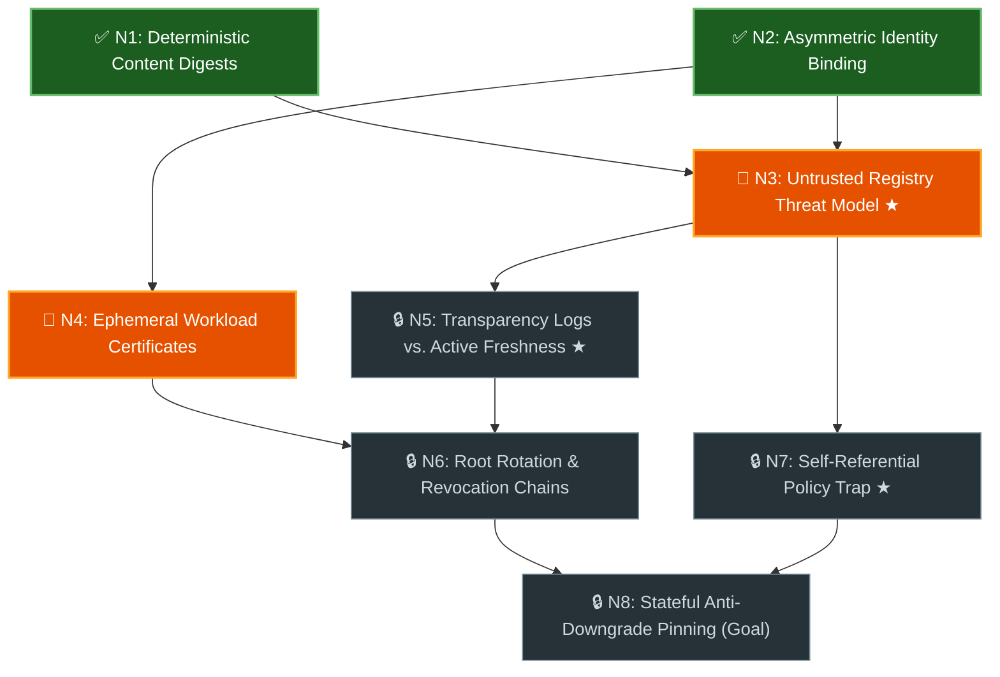

# Graph Learn (`<topic>_learning_graph.md`) Artifact & Turn Schemas

Reference templates for the persistent `<topic>_learning_graph.md` artifact,
Mermaid visual state classes, and Teaching Block + Fresh Transfer Question
(`N_x-T1`) turns.

## 1. Persistent Graph Document Template (`<topic>_learning_graph.md`)

Keep Turn 1 lightweight and spoiler-free (`<= 80` lines including the Mermaid
diagram): populate **Part 1** with only the live Mermaid diagram, the full
1-row-per-node Concept Index table, and the active `Scenario Checks`. Populate
**Part 2 (Mastered Notes & Reference Appendix)** lazily as concepts unlock.

````markdown
# Prerequisite Graph: {topic_title}

- **Progress:** 🟢 **Mastered:** `N1`, `N2` · 🟠 **Ready Next:** `N3`, `N4` · ⚪ **Locked:** `N5`–`N8`

## Part 1: Live Prerequisite Graph & Active Scenario Gates



| Node | Concept | Direct Prerequisites | Status |
| :--- | :--- | :--- | :--- |
| `N1` | Deterministic Content Digests | _(None — Root)_ | ✅ Mastered |
| `N2` | Asymmetric Identity Binding | _(None — Root)_ | ✅ Mastered |
| `N3` | Untrusted Registry Threat Model `★` | `N1`, `N2` | 🎯 Ready Next |
| `N4` | Ephemeral Workload Certificates | `N2` | 🎯 Ready Next |
| `N5` | Transparency Logs vs. Active Freshness `★` | `N3` | 🔒 Locked |
| `N6` | Root Rotation & Revocation Chains | `N4`, `N5` | 🔒 Locked |
| `N7` | Self-Referential Policy Trap `★` | `N3` | 🔒 Locked |
| `N8` | Stateful Anti-Downgrade Pinning (Goal) | `N6`, `N7` | 🔒 Locked |

### Active Gate `N3`: Untrusted Registry Threat Model `★ Key Mental Shift`
1. A client downloads `pkg-1.0.tar.gz` and verifies a valid signature over its `SHA-256` digest and source repository URL, but the signed payload omits the package name `pkg`. How can a malicious mirror exploit this without breaking the signature?
2. Why can't a client safely skip verification when `GET /packages/pkg/attestation` returns `404 Not Found` under an untrusted-registry threat model?

---

## Part 2: Mastered Notes & Reference Appendix (Populated as Concepts Unlock)

- **`N1` (Deterministic Content Digests) — Mastered:** Binds verification to canonical byte digests (`SHA-256`) rather than mutable version tags (`lib/digest.dart`).
- **`N2` (Asymmetric Identity Binding) — Mastered:** Signs structured `(subject, digest)` envelopes so verifiers authenticate both artifact and publisher (`lib/envelope.dart`).
````

## 2. Teaching Block & Fresh Transfer Question (`N_x-T1`) Pattern

When the user asks `"I don't know — teach me!"` or reveals a misconception on
concept `N_x`:

1. **Pinpoint the Exact Conceptual Gap**: State what was right and what
   invariant was missed (e.g., _"You noted the git tag matches, but the catch is
   that the client never queries git history at install time..."_).
2. **Concrete Mechanism + Structural Analogy**: Pair the exact code/protocol
   mechanic (`lib/verifier.dart#L84`) with a crisp structural analogy (e.g.,
   _"passive security camera vs. active door lock"_).
3. **Fresh Transfer Question (`N_x-T1`)**: Pose a **new scenario** testing the
   same invariant from a fresh angle (never re-asking the original question or
   marking `✅ Mastered` on a passive `"Does that make sense?"`).
