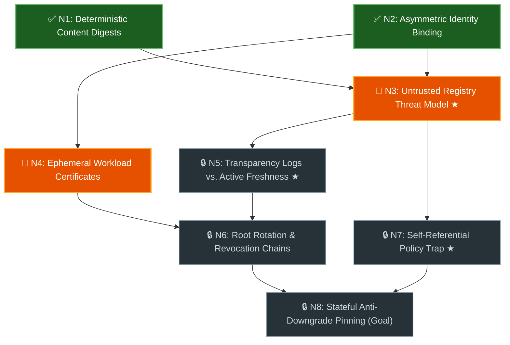

# Teach Me (`/teach-me`)

Use this skill to help the user build a genuine, load-bearing mental model of a
complex technical domain, specification, or codebase architecture. Skimming an
AI summary of an unfamiliar topic creates an illusion of competence; grounding
every concept in primary sources and separating **Assessment**
(`Scenario Check`, `Transfer Question`) from **Pedagogy** (`Teaching Block`,
analogies) ensures each foundational invariant clicks before dependent concepts
unlock.

## Core Rules, Layers & Plain-Language Vocabulary

Keep all user-facing artifacts, Mermaid diagrams, and chat updates in clear,
self-explanatory engineering language—never leak academic set-theory or graph
jargon (such as _"Knowledge Space Theory"_, _"Hasse diagram"_, _"surmise
relation"_, _"Outer Fringe"_, or `$F^+(K)$`) to the user, and keep
**Assessment** strictly separated from **Pedagogy**:

| Layer          | Concept                                | Rule for the Agent                                                                                                                                                                                                                                      | User-Facing Term & Badge         |
| :------------- | :------------------------------------- | :------------------------------------------------------------------------------------------------------------------------------------------------------------------------------------------------------------------------------------------------------ | :------------------------------- |
| **Structure**  | **Atomic Concept**                     | Model each node (`N1`, `N2`, ...) as **one single load-bearing mechanism or invariant** anchored to an auditable primary `Source` (`file#L...` or spec section). Never merge distinct mechanisms into a muddy umbrella node just to keep the count low. | `Concept` (`N1`, `N2`, ...)      |
| **Structure**  | **Hard Prerequisite (`A -> B`)**       | Draw `A -> B` **only** when concept `B` cannot be genuinely understood or applied without `A`. Omit loose "related-to" associations and redundant shortcut arrows (`A -> C` when `A -> B -> C` exists).                                                 | `Prerequisite`                   |
| **Structure**  | **Convergence Node**                   | A concept with **`>= 2` direct prerequisites** (`N1 -> N3` and `N2 -> N3`). Graph mode requires at least one convergence node.                                                                                                                          | _(Convergent arrows in diagram)_ |
| **State**      | **Mastered State**                     | Concepts the user has empirically verified through an Assessment check (`Scenario Check` or `Transfer Question`) or calibration fast-forward.                                                                                                           | `✅ Mastered` (Green)            |
| **State**      | **Ready Next (Unlocked)**              | Unmastered concepts whose direct prerequisites are **all** `✅ Mastered`. These are the **only** concepts eligible for teaching and probing on the current turn (except a one-time Turn 1 calibration probe).                                           | `🎯 Ready Next` (Amber)          |
| **State**      | **Locked State**                       | Concepts still waiting on one or more unmastered prerequisites. Never quiz or lecture on these prematurely once calibration resolves.                                                                                                                   | `🔒 Locked` (Slate)              |
| **State**      | **Key Mental Shift**                   | The 2–4 transformative ideas in the domain that permanently change how you reason about the system (e.g., shifting from perimeter/HTTPS trust to an untrusted-intermediary model).                                                                      | `★ Key Mental Shift`             |
| **Assessment** | **Scenario Check**                     | A concrete 1–3 sentence causal or failure-mode probe issued **before** explaining an unmastered concept to test whether the user already owns the invariant.                                                                                            | `Scenario Check`                 |
| **Assessment** | **Fresh Transfer Question (`N_x-T1`)** | A post-teaching verification probe that **changes the failure mode or scenario mechanics** (never just swapping surface nouns) so it fails for a different operational reason if the invariant did not click.                                           | `Transfer Question (N_x-T1)`     |
| **Pedagogy**   | **Teaching Block**                     | A focused explanation delivered when a `Scenario Check` misses or the user says `"teach me"`—citing exact primary-source code/specs and optional structural analogies. **Never counts as proof of mastery on its own.**                                 | `Teaching Block`                 |

---

## The Workflow at a Glance

Copy this checklist to track progress across the session:

- [ ] **Phase 1: Ground in Primary Sources & Run Topology/Scope Gates** → Read
      the owning code/specs first, map atomic concepts with a mandatory `Source`
      column, gate with the user if there are **0 convergence nodes** or
      **`> 15` concepts**, and save `<topic>_learning_graph.md`.
- [ ] **Phase 2: Diagnostic Calibration** → Calibrate starting state
      (`✅ Mastered` vs. `🎯 Ready Next`) via leaf-first probes or a root-first
      walk (Execution Halted for User Input).
- [ ] **Phase 3: Ready-Next Assessment & Pedagogy Loop** → Run iterative
      `Scenario Checks`, targeted `Teaching Blocks`, failure-mode
      `Transfer     Questions (N_x-T1)`, and live diagram updates on
      `🎯 Ready Next` concepts.
- [ ] **Phase 4: Five-Way Miss Diagnosis & Dynamic Updates** → Diagnose missed
      checks using the 5-way rubric in
      [references/miss-diagnosis-examples.md](references/miss-diagnosis-examples.md)
      before mutating the graph.
- [ ] **Phase 5: Mastery Closure & Practical Payoff** → Summarize key mental
      shifts and transition directly to concrete codebase, design, or
      `/slice-and-dice` review work.

---

## Detailed Execution Phases

### Phase 1: Ground in Primary Sources & Run Pre-Flight Topology / Scope Gates

1. **Ground in Primary Sources with Auditable `Source` Anchors:**
   - Before drafting any concepts, read the actual codebase files, protocol
     specifications, or design documents that define the system. If the graph
     comes from model priors rather than primary sources, every downstream check
     tests the wrong mental model.
   - Assign every concept an explicit **`Source` entry** in the Concept Index
     table (e.g., `lib/src/verifier.dart#L42-L78`, `RFC 9110 §9.3`, or
     `_(Domain invariant — no local file)_` for pure conceptual topics).
2. **Draft Atomic Concepts & Enforce Pre-Flight Topology / Scope Gates:**
   Identify the atomic concepts and their direct hard prerequisites without
   artificially compressing or dropping topics. Before writing the full learning
   artifact, enforce two pre-flight gates:
   - **Convergence Topology Gate (`0` Convergence Nodes or `< 5` Concepts):** A
     prerequisite graph only earns its visual and algorithmic overhead when the
     domain contains **at least one convergence node** (two or more direct
     prerequisites feeding one concept, such as `N1 -> N3` and `N2 -> N3`), with
     `>= 5` concepts as a secondary heuristic. An 8-concept straight chain
     (`N1 -> N2 -> ... -> N8`) or a flat 3-item checklist gets zero benefit from
     a DAG diagram or leaf-first transitive fast-forward.
     - If the mapped concepts have **0 convergence nodes** (or `< 5` items):
       **halt before creating `<topic>_learning_graph.md`**.
     - State clearly why a prerequisite graph adds no value here (_"These {n}
       concepts form a straight sequential chain / unordered set with zero
       convergence nodes"_ or _"This topic only has {n} concepts"_), and offer
       (via an interactive choice modal such as `ask_question` /
       `AskUserQuestion` if available, or numbered options in chat):
       1. `(Recommended) Run linear/thematic mastery checks in teach-me` — keep
          the full **Assessment (`Scenario Check` + `N_x-T1` Transfer Question)
          - Pedagogy (`Teaching Block`)** loop over a compact `[1/N]` checklist
            (with the `Source` column) without a Mermaid graph or leaf-first
            fast-forward.
       2. `Take an unquizzed guided tour` — walk through the concepts one at a
          time with primary-source `Teaching Blocks` and zero quizzing (or
          switch to `/slice-and-dice` if reviewing/co-editing a document).
       3. `Broaden scope into a convergent system graph` — include upstream
          prerequisites or adjacent subsystems so genuine convergence
          dependencies emerge (or answer directly in chat if `< 3` trivial
          items).
   - **Upper-Bound Gate (`> 15` Atomic Concepts):** Never compress multiple
     distinct mechanisms into one node or silently skip important concepts just
     to stay under 15 nodes. If mapping the domain at honest atomic granularity
     yields **`> 15` concepts**:
     - **Halt before starting calibration**. Present a high-level cluster
       breakdown in chat (showing how the `N` concepts group into sub-areas) and
       prompt the user (via an interactive choice modal if available, or
       numbered options in chat):
       1. `(Recommended) Start with {sub_area} first ({k} concepts)` — master
          the foundational sub-graph first before expanding into downstream
          sub-graphs.
       2. `Prune to a specific target goal` — ask what concrete task (e.g.,
          reviewing a specific PR, debugging a specific flow) the user wants to
          reach, and keep only the prerequisite chain required for that goal.
       3. `Proceed with all {n} concepts in one graph` — explicit escape hatch.
3. **Construct the Persistent Graph Document (`5–15` Concepts with Convergence,
   Zero-Spoiler & Lazy Notes):** Once a convergent graph scope is confirmed,
   save `<topic>_learning_graph.md` in the session's artifact directory (or
   `/tmp/<topic>_learning_graph.md` in standalone CLI sessions—never create
   untracked files in the repository worktree).
   - **Keep Turn 1 Lightweight & Spoiler-Free (`<= 80` lines including the
     Mermaid diagram):** On Turn 1, populate **Part 1** with only the live
     Mermaid diagram, the full 1-row-per-node Concept Index table (including the
     **`Source`** column), and the active `Scenario Checks`. **Never** print
     `Common Misconceptions` or `One-Line Definition` explanations above an
     unmastered scenario check (which hands the user the answer), and **never**
     pre-write multi-line textbook sections for `🔒 Locked` concepts on Turn 1.
   - **Record Mastery Notes Lazily in Part 2:** Append `Key Mental Shift`
     summaries, misconception notes, and code/spec mappings into **Part 2
     (Mastered Notes & Reference Appendix)** _as_ concepts are taught or
     mastered.
4. **Render the Live Color-Coded Mermaid Diagram:** Initialize the diagram with
   explicit visual state classes from Turn 1 and update it after every gate:
   - `mastered` (`✅`): Mastered.
   - `ready` (`🎯`): Ready Next (all direct prerequisites mastered). Include
     partial progress badges such as `(1/2)` when a two-part concept is half
     complete.
   - `locked` (`🔒`): Locked (waiting on upstream prerequisites).
   - Flag key mental shifts with `★` inside the node label.

#### Persistent Graph Document Template (`<topic>_learning_graph.md`)

````markdown
# Prerequisite Graph: {topic_title}

- **Progress:** 🟢 **Mastered:** `N1`, `N2` · 🟠 **Ready Next:** `N3`, `N4` · ⚪ **Locked:** `N5`–`N8`

## Part 1: Live Prerequisite Graph & Active Scenario Gates



| Node | Concept | Direct Prerequisites | Source | Status |
| :--- | :--- | :--- | :--- | :--- |
| `N1` | Deterministic Content Digests | _(None — Root)_ | `lib/src/digest.dart#L18-L45` | ✅ Mastered |
| `N2` | Asymmetric Identity Binding | _(None — Root)_ | `lib/src/envelope.dart#L30-L72` | ✅ Mastered |
| `N3` | Untrusted Registry Threat Model `★` | `N1`, `N2` | `docs/threat_model.md#L12-L58` | 🎯 Ready Next |
| `N4` | Ephemeral Workload Certificates | `N2` | `lib/src/oidc_Fulcio.dart#L50-L94` | 🎯 Ready Next |
| `N5` | Transparency Logs vs. Active Freshness `★` | `N3` | `lib/src/rekor_verifier.dart#L64-L110` | 🔒 Locked |
| `N6` | Root Rotation & Revocation Chains | `N4`, `N5` | `lib/src/tuf_root.dart#L22-L89` | 🔒 Locked |
| `N7` | Self-Referential Policy Trap `★` | `N3` | `lib/src/policy_loader.dart#L15-L49` | 🔒 Locked |
| `N8` | Stateful Anti-Downgrade Pinning (Goal) | `N6`, `N7` | `lib/src/lockfile_pin.dart#L40-L105` | 🔒 Locked |

### Active Gate `N3`: Untrusted Registry Threat Model `★ Key Mental Shift`
1. A client downloads `pkg-1.0.tar.gz` and verifies a valid signature over its `SHA-256` digest and source repository URL, but the signed payload omits the package name `pkg`. How can a malicious mirror exploit this without breaking the signature?
2. Why can't a client safely skip verification when `GET /packages/pkg/attestation` returns `404 Not Found` under an untrusted-registry threat model?

---

## Part 2: Mastered Notes & Reference Appendix (Populated as Concepts Unlock)

- **`N1` (Deterministic Content Digests) — Mastered:** Binds verification to canonical byte digests (`SHA-256`) rather than mutable version tags (`lib/src/digest.dart#L18-L45`).
- **`N2` (Asymmetric Identity Binding) — Mastered:** Signs structured `(subject, digest)` envelopes so verifiers authenticate both artifact and publisher (`lib/src/envelope.dart#L30-L72`).
````

---

### Phase 2: Diagnostic Calibration

Keep the Turn 1 chat response concise (`<= 25` lines): link to
`<topic>_learning_graph.md` (where the full Mermaid diagram and 1-row-per-node
Concept Index table with `Source` links live—do not paste a duplicate Mermaid
code block into chat when the artifact is saved), show a compact summary table
(collapsing `🔒 Locked` range rows such as `N5–N8` when needed to stay `<= 25`
lines), avoid raw LaTeX math (`$...$`) in prose, and calibrate the starting
`🎯 Ready Next` concepts:

1. **Path A — Leaf-First Calibration (Default on Convergent DAGs when prior
   knowledge is partial or unknown):**
   - Initialize the Turn 1 Mermaid diagram with foundational root concepts
     marked `🎯 Ready Next` and downstream nodes `🔒 Locked`, then issue a
     **one-time diagnostic calibration probe** on 1–2 mid-tier or convergence
     concepts using short `Scenario Checks` (1–3 sentence answers).
   - **Automatic Prerequisite Credit (Fast-Forward):** When the user passes an
     advanced `Scenario Check`, automatically mark both that concept and all of
     its upstream prerequisites `✅ Mastered` so experienced users skip
     fundamentals they already know.
   - **Walk Backward on Misses:** When a calibration probe misses (or the user
     replies `"I don't know"`), **do not teach the advanced node yet**—leave it
     `🔒 Locked`, trace backward along incoming prerequisite arrows to locate
     the earliest unmastered prerequisite (`N1`, `N2`, ...), and probe/teach
     that `🎯 Ready Next` prerequisite first.
2. **Path B — Root-First Foundation Walk (When the user is new to the topic,
   chooses linear mastery mode, or says `"Start at the roots"`):**
   - Start with 0 `✅ Mastered` nodes.
   - Mark the foundational root concepts (or item `[1/N]` in linear mode) as
     `🎯 Ready Next` and present only their `Scenario Checks`.

> [!IMPORTANT]
>
> **Strict Interactive Gate:** After presenting the initial calibration probes
> (or root `Scenario Checks`), stop calling tools and wait for the user's
> response. Never simulate user answers or advance through multiple layers in a
> single turn.

---

### Phase 3: The Ready-Next Assessment & Pedagogy Loop

On each turn, focus strictly on the active **`🎯 Ready Next`** concepts:

1. **Bound Each Turn to 1–2 `🎯 Ready Next` Concepts:**
   - Never lecture on or quiz `🔒 Locked` downstream concepts whose
     prerequisites are not yet `✅ Mastered`.
   - Keep `Scenario Checks` concise: 1–2 concrete causal or failure-mode
     questions per concept requiring 1–3 sentences from the user.
2. **Treat `"I Don't Know — Teach Me!"` as First-Class Signal (Pedagogy →
   Assessment):**
   - Encourage the user to say `"I don't know / teach me"` whenever a scenario
     hits unfamiliar territory.
   - When the user asks to be taught—or when a missed check is diagnosed as an
     **Active Concept Gap**—deliver a focused **Teaching Block** (Pedagogy):
     - Address the exact conceptual gap first (e.g., _"You guessed X; the catch
       is that the verifier never queries git history at install time..."_).
     - Explain the mechanism using the concept's primary `Source` code/spec
       details paired with a memorable structural analogy (e.g., _"passive
       security camera vs. active door lock"_).
   - **Issue a Fresh Transfer Question (`N_x-T1`) (Assessment):**
     - Never mark a concept `✅ Mastered` solely because you delivered a
       `Teaching Block` or because the user agreed with an analogy.
     - **Definition of "Fresh" (`Change Failure Mode, Not Nouns`):** Do not
       re-ask a reworded copy of the original question with swapped variable or
       service names. Change the **failure mode or scenario mechanics** so that
       `N_x-T1` would fail for a _different operational reason_ than the
       original check if the underlying invariant is not understood (see
       [references/miss-diagnosis-examples.md](references/miss-diagnosis-examples.md)).
3. **Track Partial Concept Progress (`(1/2)`):**
   - If a concept check has two load-bearing sub-questions (`a` and `b`) and the
     user passes `a` while missing `b`:
     - Mark `a` mastered immediately.
     - Provide a crisp micro-correction + fresh transfer question for `b` only.
     - Label the node `(1/2)` on `🎯 Ready Next` in the Mermaid diagram until
       `b` passes.
4. **Update the Live Mermaid Diagram on Every Turn:**
   - Whenever any concept advances (`🔒 -> 🎯 -> ✅` or `(1/2) -> ✅`), update
     both the Progress line and the Mermaid node classes/badges in
     `<topic>_learning_graph.md` **before** sending your chat response.
   - State the updated **`✅ Mastered`** and **`🎯 Ready Next`** concepts in a
     compact 2-line status header in chat so progress is unmistakable.

---

### Phase 4: Five-Way Miss Diagnosis & Dynamic Graph Updates

When a user's answer misses a `Scenario Check` or `Transfer Question`, **do not
reflexively insert a new node into the graph**. Consult
[references/miss-diagnosis-examples.md](references/miss-diagnosis-examples.md)
and evaluate these five causes in order:

1. **Ambiguous Scenario Question (Agent Fault — Zero Graph Mutation, No
   Lecture):** If the user's answer holds up under a reasonable interpretation
   because your prompt left a boundary condition unspecified, state the missing
   constraint in 1 sentence and re-pose the tightened check (or grant mastery if
   their answer already proved the invariant).
2. **Active Concept Gap / `"Teach Me"` (Normal Path — Zero Graph Mutation):** If
   prerequisites are solid and the question was unambiguous, keep the graph
   unchanged, deliver a `Teaching Block`, and pose a fresh `N_x-T1` transfer
   question.
3. **Curiosity Tangent (Zero Graph Mutation):** If the user asks about a
   downstream `🔒 Locked` concept or an implementation detail, answer in 1–2
   sentences, note which node owns that invariant, and return to the active
   `🎯 Ready Next` check.
4. **Overloaded Concept (`Split Node`):** Only when a single node accidentally
   bundles two independent mechanisms that fail for unrelated reasons, split it
   into `N_xa` (`✅ Mastered`) and `N_xb` (`🎯 Ready Next`) with distinct
   `Source` anchors.
5. **Missing Upstream Prerequisite (`Insert Node`):** Only when the user's
   answer reveals a gap in an _unmapped foundational mechanism external to
   `N_x`_, insert `N_new -> N_x`, move `N_x` back to `🔒 Locked`, and make
   `N_new` the active `🎯 Ready Next` concept.

---

### Phase 5: Mastery Closure & Practical Payoff

Once every goal/leaf concept is `✅ Mastered`:

1. **Finalize the Graph Artifact:** Mark all concepts `✅ Mastered`
   (`100% Complete`) in `<topic>_learning_graph.md`.
2. **Emit a Final Summary:**
   - **Starting Baseline → All Concepts Mastered**.
   - **Load-Bearing Takeaways:** 3–5 bullet points distilling the
     `★ Key Mental Shifts` and system invariants (with `Source` links) the user
     now owns.
3. **Pivot to Practical Action:** Immediately offer (or transition into)
   applying the newly mastered mental model to the user's concrete goal—such as
   running `/slice-and-dice` (`SND`) to review or co-edit the target RFC/PR
   section by section, auditing open diffs against the threat model, or writing
   the implementation.

---

## Anti-Patterns & Guardrails

- **No Academic Jargon in User Output:** Keep every Mermaid class, node label,
  and chat message strictly within the plain-language vocabulary defined in
  **Core Rules, Layers & Plain-Language Vocabulary** (`Prerequisite Graph`,
  `Mastered`, `Ready Next`, `Locked`).
- **No Unanchored Priors When Source Exists:** Never build a codebase or
  specification graph from memory alone—populate the `Source` column in the
  Concept Index before issuing Turn 1 checks.
- **No Passive Walls of Text Before Probing:** During calibration or when a new
  `🎯 Ready Next` concept unlocks, ask the `Scenario Check` first (unless the
  user explicitly chose an unquizzed tour or asked you to teach the concept
  upfront).
- **No Trivia or Noun-Swapped Transfer Questions:** Never ask _"What does
  acronym X stand for?"_, and never issue an `N_x-T1` transfer question that
  merely swaps surface nouns while keeping the exact same failure mode.
- **No Self-Grading (`"Does that make sense?"`):** Never ask _"Does that make
  sense?"_ and mark a concept mastered on _"Yes"_.
- **Analogy Is Pedagogy, Not Proof:** Analogies belong in `Teaching Blocks`
  (Pedagogy) to build intuition; mastery transitions (`🎯 -> ✅`) require
  passing a `Scenario Check` or `Transfer Question` (Assessment) grounded in the
  actual `Source` system.
