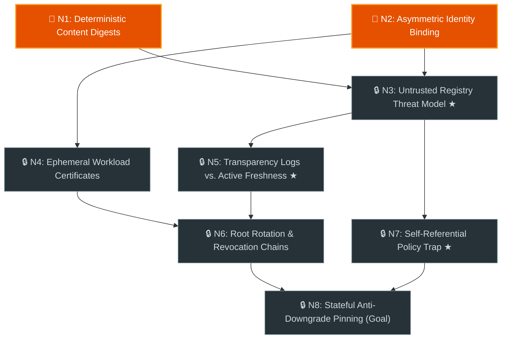

# Teach Me (`<topic>_learning_graph.md`) Artifact & Turn Schemas

Reference templates for the persistent `<topic>_learning_graph.md` artifact,
Turn 1 root-first + skip-ahead chat presentation (`<= 25` lines), and
single-concept `Teaching Block` + `Transfer Question (N_x-T1)` chat turns.

## 1. Persistent Graph Document Template (`<topic>_learning_graph.md`)

Keep Turn 1 `<= 80` lines and spoiler-free (no definitions or misconception
explanations above unmastered checks; populate Part 2 lazily as nodes become
`✅ Mastered`).

````markdown
# Prerequisite Graph: {topic_title}

- **Progress:** 🟢 **Mastered:** _(None yet)_ · 🟠 **Ready Next:** `N1`, `N2` · ⚪ **Locked:** `N3-N8`

## Part 1: Live Prerequisite Graph & Active Scenario Check



| Node | Concept | Direct Prerequisites | Source | Status |
| :--- | :--- | :--- | :--- | :--- |
| `N1` | Deterministic Content Digests | _(None - Root)_ | `lib/src/digest.dart#L18-L45` | 🎯 Ready Next |
| `N2` | Asymmetric Identity Binding | _(None - Root)_ | `lib/src/envelope.dart#L30-L72` | 🎯 Ready Next |
| `N3` | Untrusted Registry Threat Model `★` | `N1`, `N2` | `docs/threat_model.md#L12-L58` | 🔒 Locked |
| `N4` | Ephemeral Workload Certificates | `N2` | `lib/src/oidc_fulcio.dart#L50-L94` | 🔒 Locked |
| `N5` | Transparency Logs vs. Active Freshness `★` | `N3` | `lib/src/rekor_verifier.dart#L64-L110` | 🔒 Locked |
| `N6` | Root Rotation & Revocation Chains | `N4`, `N5` | `lib/src/tuf_root.dart#L22-L89` | 🔒 Locked |
| `N7` | Self-Referential Policy Trap `★` | `N3` | `lib/src/policy_loader.dart#L15-L49` | 🔒 Locked |
| `N8` | Stateful Anti-Downgrade Pinning (Goal) | `N6`, `N7` | `lib/src/lockfile_pin.dart#L40-L105` | 🔒 Locked |

### Active Check `N1`: Deterministic Content Digests
Why does verifying a release against a mutable Git tag (`v1.0.0`) fail to guarantee artifact integrity even over TLS, and what property of a canonical `SHA-256` tarball digest closes that gap?

---

## Part 2: Mastered Notes & Reference Appendix (Populated as Concepts Unlock)

- _(Populated lazily as each concept reaches `✅ Mastered`.)_
````

## 2. Turn 1 Chat Skeleton: Root-First Start + Conversational Skip-Ahead (`<= 25` Lines)

Do not paste a duplicate Mermaid diagram into chat when
`<topic>_learning_graph.md` is saved. Start at **1 foundational root concept
(`N1`)** and invite the user to skip ahead if they already know the
fundamentals:

```markdown
Saved the live prerequisite graph and source index to [`<topic>_learning_graph.md`](file:///path/to/<topic>_learning_graph.md).

| Node | Concept | Prereqs | Source | Status |
| :--- | :--- | :--- | :--- | :--- |
| **`N1`** | **Deterministic Content Digests** | _(Root)_ | `lib/src/digest.dart#L18-L45` | 🎯 **Active** |
| `N2` | Asymmetric Identity Binding | _(Root)_ | `lib/src/envelope.dart#L30-L72` | 🎯 Ready Next |
| `N3` | Untrusted Registry Threat Model `★` | `N1`, `N2` | `docs/threat_model.md#L12-L58` | 🔒 Locked |
| `N4-N8` | Certs, Rekor Logs `★`, TUF Rotation, Policy Trap `★`, Pinning | `N2-N7` | _(See artifact)_ | 🔒 Locked |

> **Skip-Ahead Anytime:** We're starting at `N1` (`1` concept at a time). If you already know `N1`/`N2`, just say *"Skip N1 and N2, start at N3"* (or `"teach me"` if you'd like the explanation right away).

### Scenario Check `N1`: Deterministic Content Digests
Why does verifying a release against a mutable Git tag (`v1.0.0`) fail to guarantee artifact integrity even over TLS, and what property of a canonical `SHA-256` tarball digest closes that gap?
```

## 3. Chat Turn Skeleton: Teaching Block & Fresh Transfer Question (`N_x-T1`)

Focus on **1 concept per turn** with zero robotic `- **Diagnosis:**` headers:

```markdown
**Progress:** 🟢 **Mastered:** `N1` · 🟠 **Ready Next:** `N2` · ⚪ **Locked:** `N3-N8`

### Teaching `N2`: Asymmetric Identity Binding (`docs/attestation.md#L26-L48`)
- **What Held Up & The Catch:** You're right that Ed25519 verifies the exact tarball bytes. The catch is **key provenance**: if the verifier reads `META-INF/signer.pub` from inside the downloaded tarball itself, an attacker who swaps the tarball can generate their own Ed25519 keypair, re-sign the malicious tarball, and bundle their own `signer.pub` inside it.
- **Mechanism & Analogy:** [`docs/attestation.md#L26-L48`](file:///path/to/docs/attestation.md#L26-L48) requires verifying signatures against an **out-of-band trusted root** pinned outside the untrusted archive. Bundling the public key inside the untrusted tarball is like accepting a passport strictly because the laminated photo matches the person standing in front of you, even though they printed the passport themselves.

### Transfer Check `N2-T1` (Unlocks `✅ Mastered` for `N2`)
Suppose the verifier now pins the publisher's genuine Ed25519 public key out-of-band, and the publisher signs **only** the raw `SHA-256` digest of `foo-1.0.0-alpha.tar.gz` (omitting the package name and version string from the signed envelope). How can a malicious registry exploit that valid signature when a user requests `foo@1.0.0` stable?
```
